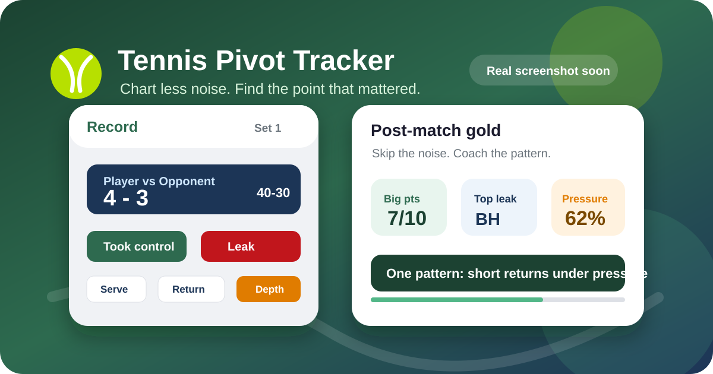

  
  <h1>Tennis Pivot Tracker</h1>
  
<strong>Chart the point that changed the point.</strong>

## The vibe

- Built for coaches who want useful patterns, not a spreadsheet marathon.
- Tap through points live from a phone or tablet.
- Spot the momentum swing: serve, return, shot choice, pressure, or opponent quality.
- Leave with one clear coaching action.

> One pattern. One action.

## Quick start

- Open `index.html` in a modern browser.
- Go to **Matches** -> **+ New Match**.
- Pick the format, scoring rules, and first server.
- Chart points in **Record**.
- Review **Sheet**, **Stats**, and optional **AI Coach**.

## What it tracks

- Score, games, sets, server, first/second serve.
- Break points, game points, set points, match points, deuce, and advantage.
- Manual big-point tags.
- MPTS 2.0 point pivots:
  - **Momentum**: took control, gave up control, opponent quality, or routine.
  - **Shot / phase**: serve, return, forehand, backhand, transition, or net.
  - **Detail**: direction, depth, decision, double fault, ace, forced error, and more.
  - **Outcome**: player won or lost the point.

## Tabs at a glance

| Tab | Job |
| --- | --- |
| **Matches** | Create, reopen, delete, import, and export match files. |
| **Record** | Log each point while the score updates itself. |
| **Sheet** | Read the match as a tidy point-by-point story. |
| **Stats** | Find leaks, pressure trends, serve/return splits, and pivot patterns. |
| **AI Coach** | Optional Gemini-powered cues and reviews. |
| **Guide** | Keep coding consistent across coaches. |

## Match options

- One set, best of 3, or best of 5.
- Normal deciding set, 7-point tie-break at 6-6, or 10-point tie-break at 6-6.
- Regular deuce/advantage or golden point/no-ad.
- Player or opponent serves first.

## Data stuff

- Browser-only storage via `localStorage`.
- JSON export/import for backups and sharing.
- Gemini API key, if used, stays in the browser.
- AI Coach only sends anonymized match stats when you ask for a summary.
- Works fine without AI.

## Project shape

- `index.html` - the whole app in one file.
- `assets/` - README visuals.
- `LICENSE` - MIT license.

## License

MIT. Go chart something useful.
