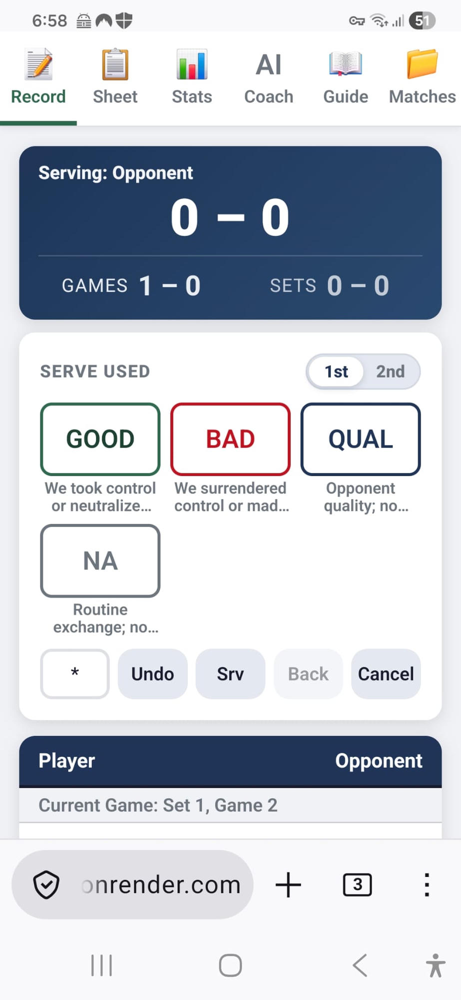

  
  <h1>Tennis Pivot Tracker</h1>
  
<strong>AI-assisted match charting for coaches who want the point behind the score.</strong>

  

## The vibe

- Built for coaches who want useful patterns, not a spreadsheet marathon.
- Tap through points live from a phone or tablet.
- Let **AI Coach** turn match stats into crisp cues and review notes.
- Spot the diagnostic reason: serve, return, technical execution, tactical choice, pressure, or opponent quality.
- Leave with one clear coaching action.

> One pattern. One action.

## AI Coach

- Optional Gemini-powered coaching layer.
- Live-match cues when you need a quick tactical nudge.
- Set and match reviews when you want the bigger pattern.
- Uses anonymized match stats; optional coach-entered context is sent as written.
- API key stays in your browser.
- The app still works perfectly without AI.

## Quick start

- Easiest: open <https://tennis-stats-t4eb.onrender.com/>.
- Local: open `index.html` in a modern browser.
- Go to **Matches** -> **+ New Match**.
- Pick the format, scoring rules, and first server.
- Chart points in **Record**.
- Review **Sheet**, **Stats**, and **AI Coach**.

## What it tracks

- Score, games, sets, server, first/second serve.
- Q/L rally band: **Q** for quick points (0-4 shots), **L** for long points (5+ shots).
- Game, set, and match duration from the first recorded stat to each automatic finish.
- Break points, game points, set points, match points, deuce, and advantage.
- Manual big-point tags.
- Diagnostic Performance Tree point tags:
  - **Neutral**: opponent-driven outcome or routine opponent miss.
  - **Good**: player winner, pressure, patience, serve-plus, return pressure, or defense.
  - **Technical**: correct idea, failed execution.
  - **Tactical**: wrong shot choice, target, timing, or recovery.
  - **Outcome**: player won or lost the point.

## Tabs at a glance

| Tab | Job |
| --- | --- |
| **Matches** | Create, reopen, delete, import, and export match files. |
| **Record** | Log each point while the score updates itself. |
| **Sheet** | Read the match as a tidy point-by-point story. |
| **Stats** | Find development summaries, grind/long-rally trends, pressure trends, serve/return splits, and diagnostic patterns. |
| **AI Coach** | Turn anonymized stats into tactical cues and match reviews. |
| **Guide** | Keep coding consistent across coaches. |

## Match options

- One set, best of 3, or best of 5.
- Normal deciding set, 7-point tie-break at 6-6, or 10-point tie-break at 6-6.
- Regular deuce/advantage or golden point/no-ad.
- Player or opponent serves first.

## Data stuff

- Browser-only storage via `localStorage`.
- JSON export/import for backups and sharing.
- Gemini API key, if used, stays in the browser.
- AI Coach only sends anonymized match stats when you ask for a summary.
- AI is optional, not required.

## Project shape

- `index.html` - the whole app in one file.
- `assets/` - README visuals.
- `LICENSE` - MIT license.

## License

MIT. Go chart something useful.
